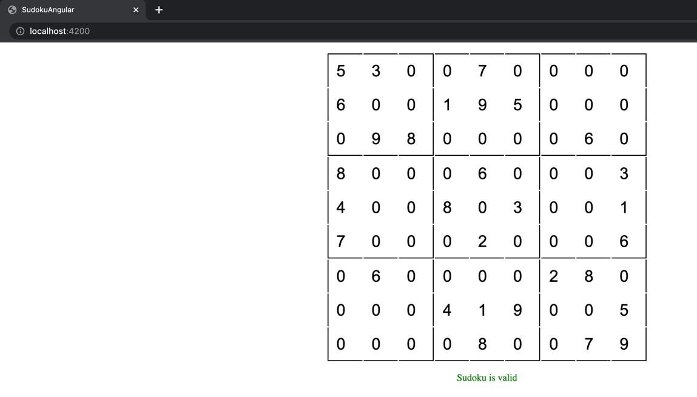

# Getting started

### To start back-end:

run next command from project root folder:  
`./mvnw spring-boot:run`  

### To start frond-end:

navigate to `web` folder:   
`cd src/main/web`  

install npm packages:   
`npm i`

then run command:   
`ng serve --open`

Example of a working app:  
  
  
  
